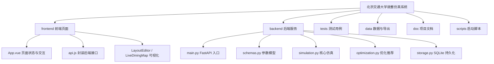
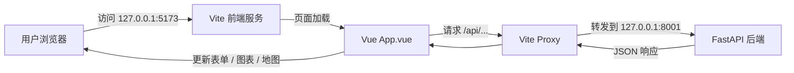
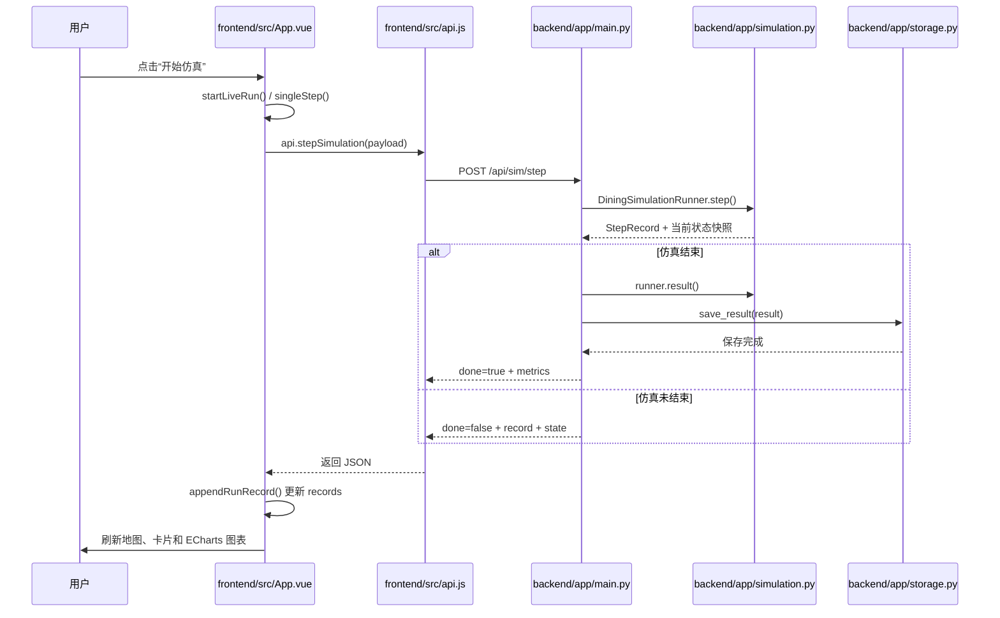
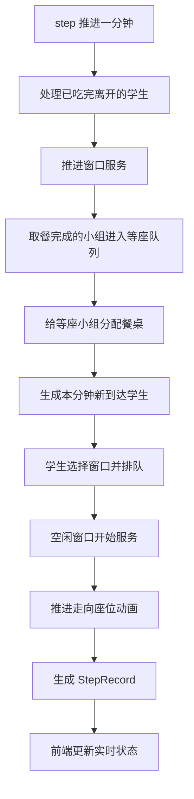
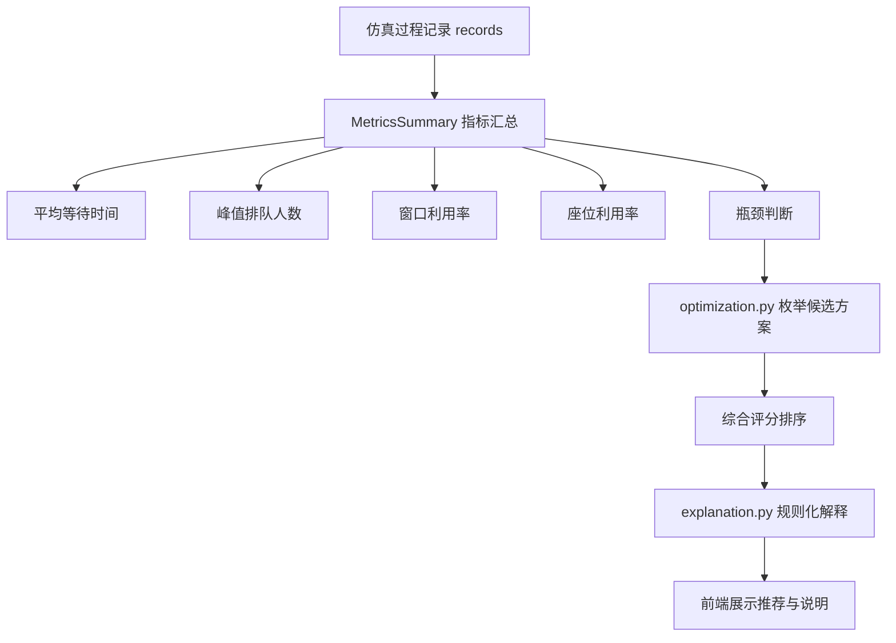

# 北京交通大学就餐仿真系统

第 20 组课程项目。系统面向学校食堂高峰就餐过程，通过参数配置、实时仿真、过程记录、指标分析、优化推荐和规则化解释，帮助观察“排队、取餐、找座、就餐离开”这一完整流程。

本 README 是课程展示用的项目总索引和说明入口。展示时可以先从这里说明项目做什么、怎么启动、文件从哪里看起，以及一次仿真请求如何从前端流到后端再回到页面。

## 1. 项目一句话介绍

这是一个“学校食堂高峰就餐过程”的离散时间仿真系统：前端配置窗口、座位、到达人数和场景布局，后端按分钟推进仿真，最后给出等待时间、排队峰值、资源利用率、瓶颈类型和优化建议。

展示时可以这样说：我们不是只做静态页面，而是把学生到达、窗口服务、等座、入座和离开都抽象成可重复运行的分钟级仿真过程。

## 2. 项目背景与目标

食堂高峰期常见问题包括排队过长、座位紧张、窗口利用不均衡、下课人流集中。项目目标是把这些现象用可配置参数和可视化过程表达出来，让阅读者能看到问题如何出现，以及增加窗口、增加座位、错峰下课等策略如何影响指标。

本项目重点不是预测真实食堂的全部细节，而是用课程项目可解释、可演示、可测试的方式展示排队系统和资源配置之间的关系。

## 3. 功能总览

| 功能 | 说明 | 展示时可以这样说 |
|---|---|---|
| 参数配置 | 设置窗口数、座位数、到达率、服务时间、就餐时间、高峰时间、随机种子 | 这些参数会转成后端 `SimulationConfig` |
| 校园到达 | 可按教学楼人数、下课时间和食堂选择概率生成到达计划 | 这是比手动平均到达更贴近校园场景的输入 |
| 场景预览 | 编辑入口、窗口、餐桌布局 | 布局会随请求一起传给后端参与排队和选座 |
| 实时运行 | 点击开始后按单步接口逐分钟推进 | 每一步由后端返回状态快照，前端刷新地图和图表 |
| 结果分析 | 展示平均等待、峰值排队、窗口利用率、座位利用率 | 指标来自后端最终 `MetricsSummary` |
| 优化推荐 | 枚举窗口、座位、错峰和峰数候选方案并排序 | 推荐是规则与评分逻辑，不依赖外部大模型 |
| 规则化解释 | 根据瓶颈和推荐结果生成说明文字 | 解释模块是本地规则化文本生成，不是 LLM 核心能力 |
| CSV 导出 | 导出每分钟过程记录 | 便于课程展示后复核数据 |

## 4. 技术栈与选型原因

| 层次 | 技术 | 选型原因 |
|---|---|---|
| 前端 | Vue 3 + Vite | 单页应用开发快，状态和组件组织清晰 |
| UI | Element Plus | 表单、表格、按钮、提示组件完整，适合课程演示 |
| 图表 | ECharts | 适合展示排队、空座、吞吐量等时间序列 |
| 后端 | FastAPI + Pydantic | 接口定义清晰，请求校验方便，自动支持 JSON |
| 仿真 | Python dataclass + 离散时间循环 | 逻辑集中、可读性强，便于说明和单元测试 |
| 存储 | SQLite + CSV | 本地运行方便，无需额外数据库服务 |
| 测试 | unittest | Python 标准库即可运行核心测试 |

## 5. 项目目录索引

```text
backend/   FastAPI 接口、仿真核心、推荐、解释、SQLite 持久化
frontend/  Vue 3 前端页面、接口封装、布局编辑、实时地图、图表展示
tests/     仿真和存储等核心单元测试
data/      本地 SQLite 数据库、日志和导出文件
doc/       设计说明、环境说明、展示说明稿
scripts/   后端和前端启动脚本
```



## 6. 快速启动

后端默认运行在 `127.0.0.1:8001`：

```bash
cd backend
python -m venv .venv
source .venv/bin/activate
python -m pip install -r requirements.txt
uvicorn app.main:app --reload --host 127.0.0.1 --port 8001
```

连通性验证：

```bash
curl http://127.0.0.1:8001/api/health
```

前端默认运行在 `127.0.0.1:5173`：

```bash
cd frontend
npm install
npm run dev
```

浏览器访问 `http://127.0.0.1:5173`。如果后端端口改变，可以在启动前端前设置 `VITE_API_TARGET`，例如：

```bash
VITE_API_TARGET=http://127.0.0.1:8000 npm run dev
```



## 7. 页面功能与操作流程

| 页面 | 主要操作 | 对应文件 |
|---|---|---|
| 参数配置 | 填写基础参数、选择手动到达或校园人数、生成推荐 | `frontend/src/App.vue` |
| 场景预览 | 编辑入口、窗口、餐桌，保持布局与窗口/座位参数同步 | `frontend/src/LayoutEditor.vue` |
| 实时运行 | 开始、暂停、单步、快速完成、导出记录 | `frontend/src/App.vue`、`frontend/src/LiveDiningMap.vue` |
| 结果分析 | 查看指标卡片、趋势图、过程记录、推荐方案 | `frontend/src/App.vue` |

展示时可以这样说：页面不是直接在前端算结果，前端负责配置、调用接口和展示；真正的单步推进和指标汇总在后端完成。

## 8. 一次仿真运行流程

完整运行可以走 `/api/sim/run` 一次算完；实时运行使用 `/api/sim/step` 多次请求，每次推进一分钟。课程展示建议演示实时运行，因为它能展示前端地图、过程记录和趋势图如何逐步变化。



## 9. 前后端数据流转

| 步骤 | 前端/后端位置 | 数据 |
|---|---|---|
| 1 | `App.vue` | 用户表单和布局组合成配置 |
| 2 | `layout.js` | `buildSimulationConfigPayload()` 生成后端请求体 |
| 3 | `api.js` | axios 发送 `/api/sim/step` 或 `/api/sim/run` |
| 4 | `main.py` | FastAPI 接收 Pydantic 模型并调用 `.to_data()` |
| 5 | `simulation.py` | dataclass 配置进入 `DiningSimulationRunner` |
| 6 | `StepRecord` | 后端返回当前分钟记录和 `snapshot` |
| 7 | `App.vue` | `records`、`currentState`、`metrics` 更新 |
| 8 | `LiveDiningMap` / ECharts | 地图、卡片、趋势图重新渲染 |

展示时可以这样说：接口字段保持稳定，前端和后端之间传递的是 JSON；后端内部再把接口模型转换成仿真用 dataclass。

## 10. 后端核心仿真逻辑

核心文件是 `backend/app/simulation.py`。`DiningSimulationRunner` 保存当前运行状态，`step()` 每次推进一分钟，先处理已经发生的服务和离开，再生成本分钟新到达学生，最后构造 `StepRecord` 返回前端。



展示时可以这样说：这是离散时间仿真，不是连续物理仿真；每一步代表一分钟，所有状态都保存在 runner 里，前端只拿当前状态快照展示。

## 11. 指标、瓶颈判断与优化推荐

指标汇总由 `MetricsSummary` 表示，主要包括平均等待时间、取餐排队等待、入座等待、峰值排队、峰值等座、吞吐量、座位利用率、窗口利用率和瓶颈类型。

模型理论说明见 [`docs/model_theory.md`](docs/model_theory.md)。当前仿真采用排队论、离散时间 DES、Agent-Based Modeling、同行小队同步、随机效用选座，以及可选 `static_floor_field` / `advanced_floor_field` 行人移动模型组成的混合模型。

`optimization.py` 不调用外部优化器，而是枚举候选配置，对每个候选估算指标并计算综合评分。评分越低表示方案越优。`explanation.py` 根据瓶颈、基准指标和推荐指标生成规则化说明；它不是外部大模型核心能力，核心仿真不依赖 LLM。



## 12. 关键文件阅读顺序

| 阅读顺序 | 文件 | 展示时怎么说 |
|---|---|---|
| 1 | `README.md` | 项目总览、启动方式、说明入口 |
| 2 | `frontend/src/App.vue` | 页面状态、按钮事件、实时运行入口 |
| 3 | `frontend/src/api.js` | 前端如何调用后端接口 |
| 4 | `frontend/vite.config.js` | `/api` 代理如何转发到后端 |
| 5 | `backend/app/main.py` | FastAPI 接口入口 |
| 6 | `backend/app/schemas.py` | 请求和返回数据结构 |
| 7 | `backend/app/simulation.py` | 核心离散时间仿真 |
| 8 | `backend/app/storage.py` | SQLite 保存与 CSV 导出 |
| 9 | `backend/app/optimization.py` | 优化推荐逻辑 |
| 10 | `backend/app/explanation.py` | 规则化解释 |
| 11 | `doc/walkthrough.md` | 现场说明稿和追问回答 |

## 13. 测试与验证

课程展示前建议至少运行：

```bash
python -m unittest tests.test_storage tests.test_simulation
cd frontend && npm run build
```

`tests.test_simulation` 重点覆盖仿真过程和指标，`tests.test_storage` 重点覆盖 SQLite 保存与 CSV 导出。前端 build 用于确认 Vue、Vite 和 ECharts 相关代码能被正常打包。

## 14. 课程展示说明路线

1. 先讲项目背景：食堂高峰期排队、座位紧张、窗口利用不均衡。
2. 再讲项目目标：通过仿真观察过程、统计指标、提出推荐。
3. 打开目录结构：说明 `frontend`、`backend`、`tests`、`data`、`doc` 的职责。
4. 打开前端运行页面：从参数配置、场景预览、实时运行、结果分析四个页面讲。
5. 打开 `frontend/src/App.vue`：说明点击开始仿真会进入 `startLiveRun()` 和 `singleStep()`。
6. 打开 `frontend/src/api.js`：说明前端通过 axios 调后端 `/api/sim/step`。
7. 打开 `backend/app/main.py`：说明 FastAPI 接口接收请求并调用仿真器。
8. 打开 `backend/app/simulation.py`：说明 `DiningSimulationRunner.step()` 每次推进一分钟。
9. 打开结果分析页：说明平均等待、峰值排队、窗口利用率、座位利用率和瓶颈判断。
10. 最后讲推荐：根据候选窗口数、座位数、错峰时间和下课峰数进行评分排序。

## 15. 常见问题与回答

| 问题 | 回答 |
|---|---|
| 仿真结果为什么可重复？ | 配置中有随机种子 `seed`，同一配置和种子会得到稳定结果，便于复现实验。 |
| 前端是否直接计算仿真结果？ | 不是。前端只负责配置、调用接口和展示；核心仿真在 `backend/app/simulation.py`。 |
| 实时运行和快速完成有什么区别？ | 实时运行多次调用 `/api/sim/step`，适合看过程；快速完成调用 `/api/sim/run`，适合直接看结果。 |
| 瓶颈如何判断？ | 后端根据峰值排队、等座人数、座位利用率、窗口利用率等规则分类为座位容量、窗口服务、到达高峰或运行平衡。 |
| 推荐是否使用外部大模型？ | 不使用。推荐来自 `optimization.py` 的候选枚举和评分；`explanation.py` 是本地规则化解释，核心仿真不依赖 LLM。 |
| 数据保存在哪里？ | 完整仿真结果保存到 `data/dining_sim.sqlite`，过程记录可以通过 `/api/export/{runId}` 导出 CSV。 |
| 如果现场后端连不上怎么办？ | 先访问 `http://127.0.0.1:8001/api/health`，再确认前端 `VITE_API_TARGET` 和 Vite proxy 配置。 |

## GitHub 仓库

本地仓库已初始化。如果 GitHub API 可访问并且 `gh` 已登录，可执行：

```bash
gh repo create bjtu-dining-sim --private --source=. --remote=origin
git add .
git commit -m "Initial BJTU dining simulation system"
git push -u origin main
```
