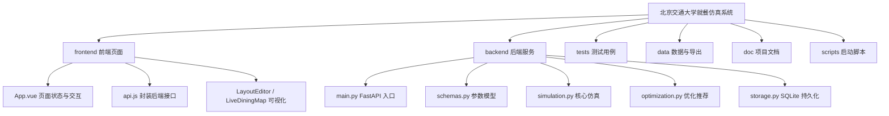
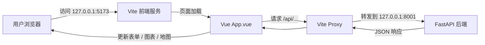
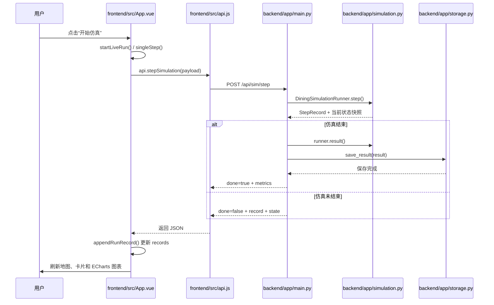
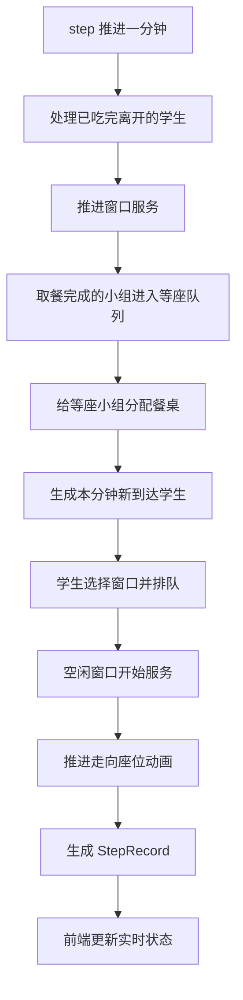
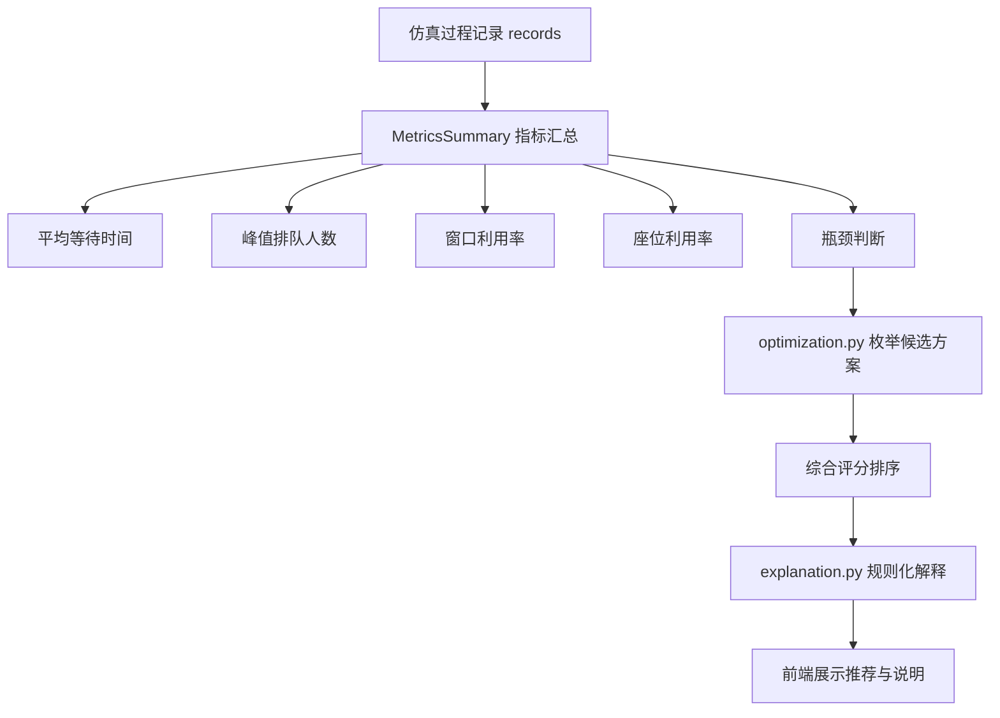

# 展示说明注释分支任务说明

本分支专门用于课程展示前的说明准备。目标是让项目代码更容易现场说清楚，而不是重构功能或改变运行效果。

## 总目标

在不改变系统功能、不改变接口行为、不破坏现有运行方式的前提下，为关键文件补充中文说明注释，并补充一份展示说明文档。注释应帮助不熟悉 Python、Vue、FastAPI 的同学快速说明：这个文件负责什么、核心函数怎么被调用、一次仿真请求从前端到后端如何流转。

本次展示准备的第一优先级是：**把 README.md 改成项目总索引 + 展示说明入口**。老师或组员打开 README 后，应能快速知道项目做什么、怎么启动、从哪些文件看起、一次仿真运行时数据如何从前端流到后端再回到前端。

## 严格禁止

- 不要重写核心算法。
- 不要调整仿真数值逻辑。
- 不要改变接口路径、字段名、返回结构。
- 不要引入新的外部依赖。
- 不要大规模格式化全文件。
- 不要把主分支 `main` 作为工作分支。
- README 可以大幅扩写，但必须保持真实，不要写项目中不存在的功能。

## 建议工作分支

```bash
git fetch origin
git checkout <work-branch>
git pull origin <work-branch>
```

## 需要重点加注释和补充说明的文件

### 1. `README.md`：必须扩写成项目索引

当前 README 偏简略，需要扩写成“项目地图”。它不仅要写启动命令，还要承担展示时的入口说明、文件索引、数据流转说明和常见追问回答。

README 建议包含以下章节：

```markdown
# 北京交通大学就餐仿真系统

## 1. 项目一句话介绍
## 2. 项目背景与目标
## 3. 功能总览
## 4. 技术栈与选型原因
## 5. 项目目录索引
## 6. 快速启动
## 7. 页面功能与操作流程
## 8. 一次仿真运行流程
## 9. 前后端数据流转
## 10. 后端核心仿真逻辑
## 11. 指标、瓶颈判断与优化推荐
## 12. 关键文件阅读顺序
## 13. 测试与验证
## 14. 课程展示说明路线
## 15. 常见问题与回答
```

README 必须加入 Mermaid 图，至少包括以下 4 张。图应使用 GitHub Markdown 支持的 Mermaid 语法，避免过于复杂导致渲染失败。

#### Mermaid 图 1：项目模块总览

用于说明 frontend、backend、tests、data、doc、scripts 分别负责什么。



#### Mermaid 图 2：启动和访问流程

用于说明后端 8001、前端 5173、Vite proxy 转发 `/api`。



#### Mermaid 图 3：一次实时仿真的数据流转

用于说明点击“开始仿真”后，从 `App.vue` 到 `api.js`、`main.py`、`simulation.py`、`storage.py` 的完整链路。



#### Mermaid 图 4：后端单步仿真内部流程

用于讲清 `DiningSimulationRunner.step()` 的分钟级离散仿真过程。



#### 可选 Mermaid 图 5：指标和推荐链路

如果篇幅允许，README 再补一张指标与推荐流程图：



README 还需要加入“关键文件阅读顺序”，建议写成表格：

| 阅读顺序 | 文件 | 展示时怎么说 |
|---|---|---|
| 1 | `README.md` | 项目总览、启动方式、说明入口 |
| 2 | `frontend/src/App.vue` | 页面状态、按钮事件、实时运行入口 |
| 3 | `frontend/src/api.js` | 前端如何调用后端接口 |
| 4 | `frontend/vite.config.js` | `/api` 代理如何转发到后端 |
| 5 | `backend/app/main.py` | FastAPI 接口入口 |
| 6 | `backend/app/schemas.py` | 请求和返回数据结构 |
| 7 | `backend/app/simulation.py` | 核心离散时间仿真 |
| 8 | `backend/app/storage.py` | SQLite 保存与 CSV 导出 |
| 9 | `backend/app/optimization.py` | 优化推荐逻辑 |
| 10 | `backend/app/explanation.py` | 规则化解释 |

README 中“课程展示说明路线”建议写成可直接照读的版本：

1. 先讲项目背景：食堂高峰期排队、座位紧张、窗口利用不均衡。
2. 再讲项目目标：通过仿真观察过程、统计指标、提出推荐。
3. 打开目录结构：说明 frontend/backend/tests/data/doc 的职责。
4. 打开前端运行页面：从参数配置、场景预览、实时运行、结果分析四个页面讲。
5. 打开 `App.vue`：说明点击开始仿真会进入 `startLiveRun()` 和 `singleStep()`。
6. 打开 `api.js`：说明前端通过 axios 调后端 `/api/sim/step`。
7. 打开 `main.py`：说明 FastAPI 接口接收请求并调用仿真器。
8. 打开 `simulation.py`：说明 `DiningSimulationRunner.step()` 每次推进一分钟。
9. 打开结果分析页：说明平均等待、峰值排队、窗口利用率、座位利用率和瓶颈判断。
10. 最后讲推荐：根据候选窗口数、座位数、错峰时间进行评分排序。

README 的风格要求：

- 用中文说明为主，术语可以保留英文文件名。
- 每个章节尽量短段落 + 表格 + Mermaid 图，便于展示时快速定位。
- 不要堆砌代码；README 是索引，不是源码复制。
- 每个关键文件说明后最好写一句“展示时可以这样说”。
- 明确说明“规则化解释不是外部大模型核心能力，核心仿真不依赖 LLM”。

### 2. `frontend/src/App.vue`

在关键区域补充中文注释：

- `defaultConfig`：默认仿真参数，例如窗口数、座位数、到达率、服务时间。
- `ref` / `reactive` 状态：解释 `runId`、`records`、`metrics`、`currentState`。
- `checkHealth()`：前端如何确认后端是否连接。
- `validateConfig()`：参数校验如何触发。
- `startLiveRun()`：点击开始仿真后的入口。
- `singleStep()`：一次单步请求如何发送到后端，后端返回后如何更新页面。
- `appendRunRecord()`：过程记录如何追加并驱动图表刷新。
- `generateRecommendation()`：优化推荐如何调用后端接口。
- `renderCharts()` / `trendOption()`：ECharts 图表数据来源。

注释风格应简洁，不要每一行都注释，重点解释“为什么”和“数据流”。

### 3. `frontend/src/api.js`

在每个接口旁补充用途注释：

- `/health`：连通性验证。
- `/config/validate`：参数校验。
- `/sim/step`：实时单步仿真。
- `/sim/run`：完整仿真。
- `/optimize/recommend`：优化推荐。
- `/explain`：规则化解释。
- `/export/{runId}`：导出 CSV。

### 4. `frontend/vite.config.js`

补充注释说明：

- Vite 前端默认端口是 5173。
- `/api` 请求通过 proxy 转发到 FastAPI 后端 8001。
- 这样前端代码里可以写 `/api/...`，不需要直接写完整后端地址。

### 5. `backend/app/main.py`

在接口分组处补充中文注释：

- FastAPI 应用入口。
- CORS 为什么允许 `127.0.0.1:5173`。
- `STORE` 用于保存 SQLite 数据。
- `ACTIVE_RUNS` 用于保存正在进行的实时仿真。
- `/api/sim/step` 如何通过 `_resolve_runner()` 找到仿真器，再调用 `runner.step()`。
- 仿真结束后为什么保存结果并返回 `metrics`。

### 6. `backend/app/schemas.py`

补充注释说明 Pydantic 模型的作用：

- `SimulationConfig` 是前端传来的核心配置。
- `Field` 用于限制参数范围。
- `to_data()` 把接口模型转换成仿真内部 dataclass。
- `RunResponse`、`StepResponse` 分别对应完整仿真和单步仿真的返回值。

### 7. `backend/app/simulation.py`

这是展示最重要的文件。补充模块级注释和关键类/函数注释：

- 文件开头说明：这是核心离散时间仿真模块。
- `SimulationConfigData`：仿真参数。
- `Student`：单个学生。
- `DiningParty`：结伴就餐小组。
- `StepRecord`：每一分钟的过程记录。
- `MetricsSummary`：最终指标汇总。
- `run_simulation()`：完整运行直到结束。
- `DiningSimulationRunner`：保存当前仿真状态。
- `step()`：推进一分钟，重点写清顺序：
  1. 处理吃完离开。
  2. 推进窗口服务。
  3. 取餐完成的小组进入等座。
  4. 给等座小组分配餐桌。
  5. 生成本分钟新到达学生。
  6. 新学生选择窗口并排队。
  7. 空闲窗口开始服务。
  8. 推进走向座位动画。
  9. 生成 StepRecord。
- `_generate_arrivals()`：手动到达与校园到达两种模式。
- `_choose_window_for_student()`：按队伍长度和距离选择窗口。
- `_choose_table_for_party()`：按容量、距离、拼桌、浪费座位等因素选择餐桌。
- `_build_metrics()`：统计平均等待、排队峰值、利用率、瓶颈类型。
- `_classify_bottleneck()`：解释座位容量、窗口服务、到达高峰、运行平衡四类判断。

### 8. `backend/app/optimization.py`

补充注释说明：

- 推荐模块通过枚举候选方案进行比较。
- 候选包括窗口数、座位数、错峰时间、下课峰数。
- `_score_candidate()` 中等待时间、峰值排队、等座人数、资源成本都会影响评分。
- 分数越低表示方案越优。

### 9. `backend/app/explanation.py`

补充注释说明：

- 这里是规则化解释，不依赖外部大模型。
- 根据瓶颈、基准指标和推荐指标生成说明文本。

### 10. `backend/app/storage.py`

补充注释说明：

- SQLite 表的作用。
- `save_result()` 保存配置、过程记录和指标。
- `export_records_csv()` 导出每分钟记录。

## 需要新增的说明文档

新增：`doc/walkthrough.md`

建议结构：

```markdown
# 北京交通大学就餐仿真系统展示说明稿

## 1. 一句话介绍
## 2. 项目文件结构
## 3. 启动方式
## 4. 一次仿真从点击到结果的运行流程
## 5. 前端关键文件说明
## 6. 后端关键文件说明
## 7. 核心仿真算法说明
## 8. 指标与瓶颈判断
## 9. 优化推荐逻辑
## 10. 老师可能追问的问题与回答
```

说明文档应与 README 互补：README 是项目索引，`walkthrough.md` 是展示现场可以照着说的口播稿。

## 验证要求

完成注释和文档后至少运行：

```bash
python -m unittest tests.test_storage tests.test_simulation
cd frontend && npm run build
```

如果环境缺少 Node 或 Python 依赖，需要在最终说明中写清楚未运行的原因，不要假装已经通过。

## 最终提交要求

提交信息建议：

```bash
git add README.md frontend/src/App.vue frontend/src/api.js frontend/vite.config.js backend/app/main.py backend/app/schemas.py backend/app/simulation.py backend/app/optimization.py backend/app/explanation.py backend/app/storage.py doc/walkthrough.md <task-file>
git commit -m "docs: add project README, comments, and walkthrough"
git push origin <work-branch>
```

最终输出请包含：

- README 新增了哪些索引章节和 Mermaid 图。
- 修改了哪些代码文件的注释。
- 没有改动哪些运行逻辑。
- 测试/构建是否通过。
- 展示时推荐从哪个文件开始说。
